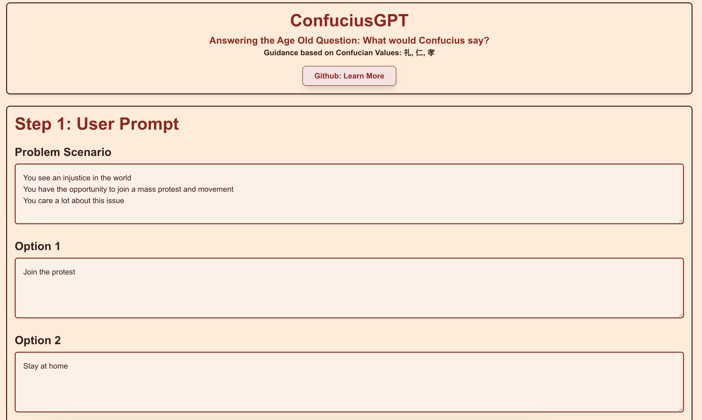
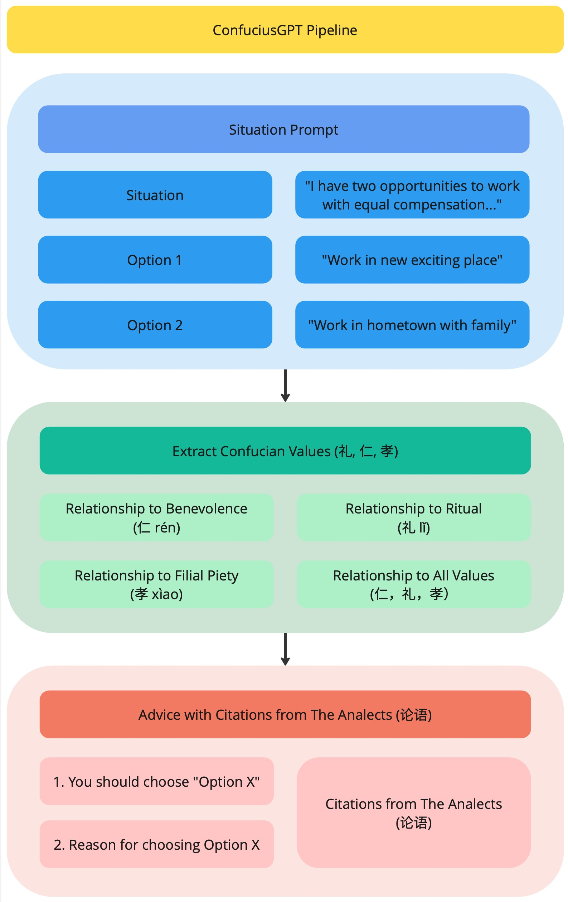

# ConfuciusGPT
One Pipeline: 2,576 Years of Confucian Thought

- Visit the website at [confucius-gpt.vercel.app](confucius-gpt.vercel.app)
- [Pitch Deck](https://drive.google.com/file/d/155gdtqX4lzVx2VkiiSxePNbmaC_0FxrJ/view?usp=sharing)

___
## Motivation:
1. Experiment with Cultural Alignment of LLMs to Confucian Values
2. Deepen understanding of the Three Confucian Virtues
3. Make Confucian Classics accessible in English with an experience tailored to each user's situation
___
## Pipeline

___
## Tech Stack

| Technology  | Purpose                               |
|-------------|---------------------------------------|
| CohereAI    | Natural language processing (LLM API) |
| Next.js     | Frontend and backend web framework    |
| TailwindCSS | Styling and responsive design         |
| Vercel      | Hosting and deployment platform       |
___
Made with the help of CohereAI's Coral and OpenAI's ChatGPT assistants